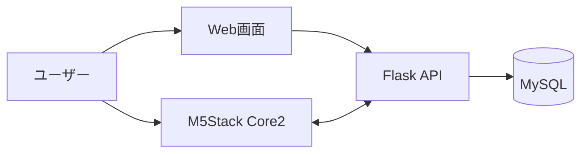

# TickStack
TickStackは、M5Stack Core2を用いた学習支援デバイスのチーム開発プロジェクトです。ポモドーロタイマーやToDo管理をスマートフォン上で使うと、通知やSNSによって集中が途切れやすいという課題に着目し、「設定はWeb画面、利用はM5Stack」という構成で学習を支援する仕組みを目指しました。

このリポジトリは、就職活動・インターン選考で提出できるように、個人情報や学内向け資料を除いた公開用ポートフォリオ版です。

M5Stack Core2上でポモドーロタイマー画面を表示している実機写真です。

## 概要

TickStackは、スマートフォンによる集中阻害を減らすことを目的とした学習支援デバイスです。

設定はWeb画面、利用はM5Stackに分離し、学習中にスマートフォンを開かなくてもポモドーロタイマーやToDoを利用できる構成を採用しました。

私は5人チームのリーダーとして、進捗管理、API仕様調整、技術選定の見直しを担当しました。

## プロジェクトの独自性

### 1. スマートフォンを開かない学習環境を目指した

一般的なポモドーロタイマーやToDo管理アプリはスマートフォン上で利用します。しかし、学習中にスマートフォンを開くこと自体が通知やSNSによる集中の中断につながると考えました。そこで、単に学習支援機能を提供するのではなく、「スマートフォンを見なくても学習できる環境」を目指して開発を行いました。

### 2. 設定と利用を分離した構成

タイマー設定やToDo登録はWeb画面で行い、学習中の利用はM5Stack Core2で行う構成を採用しました。これにより、設定時の利便性を維持しながら、学習中はスマートフォンを開かずにタイマーやタスクを確認できる仕組みを実現しました。

### 3. 開発途中で技術選定を見直した

開発当初はUIFlowを利用していましたが、機能追加を進める中で拡張性や保守性、実装自由度に課題が発生しました。そこでチーム内で検討を行い、MicroPythonへ移行しました。初期の方針に固執せず、プロジェクト全体の将来性を考慮して技術選定を見直した点が特徴です。

### 4. APIを中心とした並行開発体制を構築した

M5Stack担当、Web担当、バックエンド担当が同時に開発を進められるよう、API仕様を早い段階で整理しました。これにより、各担当が依存関係による待ち時間を減らしながら開発を進めることができました。ハードウェア・Web・バックエンドを連携するシステムにおいて、APIを中心に開発体制を構築した点も本プロジェクトの特徴です。

## 私の役割と貢献
私は5人チームのリーダーとして、プロジェクト全体の進行を担当しました。

本プロジェクトでは、M5Stack担当、Web担当、バックエンド担当に分かれて並行開発していたため、各機能の依存関係や仕様の認識ずれが発生しやすい状況でした。そこで私は、メンバーの進捗確認や課題の洗い出し、スケジュール管理を行いながら、担当間の調整役としてプロジェクト全体を支援しました。

特に注力したのは、API仕様の整理です。M5StackとWeb・バックエンド間で受け渡すデータの形式を早期に明確化することで、各担当が並行して開発を進められる環境づくりに取り組みました。

また、開発途中で当初前提としていたUIFlowの拡張性や保守性に課題が見つかった際には、チーム内で議論を行い、MicroPythonへの移行を検討・推進しました。技術的な課題だけでなく、開発体制や技術選定の観点からもプロジェクトを支えたことが私の主な役割です。

## システム構成

Web画面はFlaskのサーバーサイドレンダリングで構成し、M5Stack Core2はMicroPythonからHTTP通信でAPIにアクセスします。

## 主な機能

### ポモドーロタイマー
作業時間と休憩時間を管理し、学習の集中と休息のサイクルを支援します。

### ToDo管理
Web画面から登録したタスクをM5Stack上で確認できます。完了したタスクはデバイス上から操作でき、進捗管理を行えます。

### 時計表示
現在時刻を常時表示し、学習中の時間管理を支援します。

### 傾きによるモード切替
M5Stack Core2に搭載されたセンサーを利用し、デバイスを傾けることで表示モードを切り替えられます。

### Web画面とM5Stack Core2の連携
Flask APIを介して、Web画面で設定したタイマー情報やToDo情報をM5Stackと同期します。

### ユーザー認証
ユーザー登録・ログイン機能を実装し、個人ごとの設定やタスクを管理できるようにしました。

### M5Stack Core2との紐づけ
M5StackのUIDとWebユーザーを関連付けることで、利用者ごとに適切な設定やタスクを取得できる仕組みを実装しました。

## 使用技術

- M5Stack Core2
- MicroPython
- Flask
- Flask-Login
- PyMySQL
- MySQL
- HTML/CSS
- JavaScript
- Docker / Docker Compose
- Git / GitHub

補足: 当初はUIFlowの使用を前提としていましたが、MicroPythonに変更しています。

## 背景・課題

ポモドーロタイマーやToDo管理は学習効率の向上に有効ですが、多くの場合はスマートフォン上で利用されます。しかし、学習中にスマートフォンを開くと、通知やSNS、動画アプリなどによって集中が妨げられる可能性があります。

そこで私たちは、学習に必要な機能を利用しながらも、スマートフォンを開く機会そのものを減らせないかと考えました。

## 解決策

TickStackでは、設定と利用を分離する構成を採用しました。

- 設定：Web画面
- 利用：M5Stack Core2

ユーザーはWeb画面からタイマーやToDoを設定し、M5StackはFlask APIを通じてその情報を取得します。これにより、学習中はM5Stackのみを利用し、スマートフォンによる集中阻害を抑えることを目指しました。

## 開発上の課題と対応

### UIFlowからMicroPythonへの移行

開発当初はM5Stackの開発効率を重視し、UIFlowを採用していました。しかし、機能追加を進める中で、拡張性や保守性、実装自由度の低さが課題となりました。また、Gitを用いた差分管理も行いづらく、チーム開発との相性にも課題がありました。

そこでチーム内で技術選定を見直し、MicroPythonへ移行しました。結果として、コードベースでの管理が可能になり、機能追加や保守を行いやすい開発環境を構築できました。

### 並行開発時の仕様ずれ

本プロジェクトでは、M5Stack担当、Web担当、バックエンド担当が並行して開発を進めていました。そのため、データ形式やAPI仕様に認識のずれが生じる可能性がありました。

そこで、各担当が実装を開始する前にAPI仕様を整理し、受け渡すデータ項目や形式を明確化しました。これにより、担当間の依存関係を減らし、並行開発を円滑に進めることができました。

## 学んだこと

- ハードウェア、Web、バックエンドを連携するシステムでは、実装前にAPI仕様を整理することが開発効率や品質に大きく影響することを学びました。
- チーム開発では、機能実装だけでなく、進捗管理や課題共有、担当間の調整といったマネジメントも成果物の品質に直結することを実感しました。
- 技術選定は一度決めたら終わりではなく、プロジェクトの状況に応じて見直すことが重要であると学びました。
- リーダーとして、メンバーの作業を管理するだけでなく、チーム全体が開発しやすい環境を整えることも重要な役割であると学びました。

## docs

- [01_overview.md](docs/01_overview.md): プロジェクト概要
- [02_problem_solution.md](docs/02_problem_solution.md): 課題と解決策
- [03_my_contribution.md](docs/03_my_contribution.md): 私の役割と貢献
- [04_technical_decision.md](docs/04_technical_decision.md): 技術選定の見直し
- [05_architecture.md](docs/05_architecture.md): システム構成
- [06_api_design.md](docs/06_api_design.md): API設計
- [07_lessons_learned.md](docs/07_lessons_learned.md): 学びと振り返り
- [08_project_materials.md](docs/08_project_materials.md): 発表資料・報告書アーカイブ
