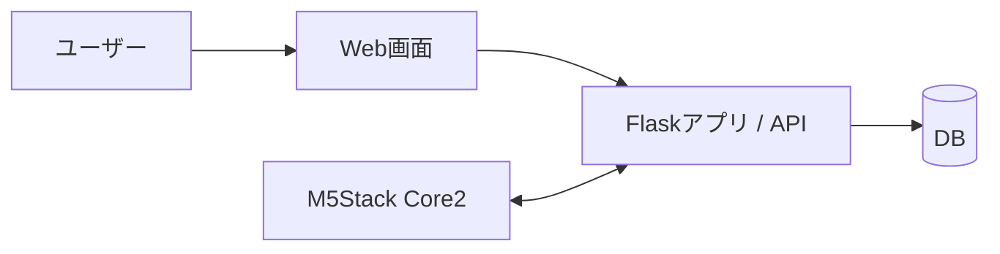

# TickStack

TickStackは、M5Stack Core2を用いた学習支援デバイスのチーム開発プロジェクトです。ポモドーロタイマーやToDo管理をスマートフォン上で使うと、通知やSNSによって集中が途切れやすいという課題に着目し、「設定はWeb画面、利用はM5Stack」という構成で学習を支援する仕組みを目指しました。

このリポジトリは、就職活動・インターン選考で提出できるように、個人情報や学内向け資料を除いた公開用ポートフォリオ版です。

## 概要

- プロジェクト名: TickStack
- 開発形態: 大学のチーム開発プロジェクト
- チーム人数: 5名
- 対象ユーザー: 学習や作業に集中したい学生・個人
- 目的: スマートフォンを開かずに、時間管理とタスク確認を行える学習支援デバイスを作る

## 背景・課題

学習中にスマートフォンでタイマーやToDoを確認すると、通知、SNS、動画アプリなどに意識が移り、作業が中断されることがあります。便利な一方で、スマートフォンを開く行為そのものが集中を妨げるきっかけになる点が課題でした。

TickStackでは、スマートフォンを操作しなくても学習に必要な情報を確認できるよう、M5Stack Core2上でタイマー・ToDo・時計表示を扱う構成にしました。

## 解決策

Web画面では、ユーザーがポモドーロタイマーの作業時間・休憩時間、ToDoの内容や期限を登録します。M5Stack側では、Flask APIを通じて登録済みの設定やToDoを取得し、デバイス上で確認・操作できるようにしました。

これにより、設定時はPCやスマートフォンのWeb画面を使い、学習中はM5Stackだけを見るという使い分けを目指しました。

## 主な機能

- ポモドーロタイマー
- ToDo登録・表示・完了処理
- 時計表示
- M5Stack Core2の傾きによるモード切替
- Web画面とM5StackのAPI連携
- ユーザー登録・ログイン
- M5StackのUIDとWebユーザーの紐づけ

## システム構成

Web画面はFlaskのサーバーサイドレンダリングで構成し、M5Stack Core2はMicroPythonからHTTP通信でAPIにアクセスします。

## 使用技術

- M5Stack Core2
- MicroPython
- Flask
- Flask-Login
- PyMySQL
- MySQL
- HTML/CSS
- JavaScript
- Docker / Docker Compose
- Git / GitHub

補足: 当初の構成検討ではSQL系DBを前提としていました。公開コードではDocker Compose上のMySQLを利用する構成になっています。

## 私の担当範囲

私はチームリーダーとして、実装そのものだけでなく、チーム全体の進め方を整える役割を担当しました。

- メンバーの進捗確認
- 問題点の洗い出し
- スケジュール管理
- 役割分担の調整
- M5Stack担当・Web担当・サーバ担当の機能間競合の防止
- API仕様調整
- 技術選定の見直しへの関与
- チーム内での課題共有と方針決定の整理

特に、M5Stack側とWeb/サーバ側を並行して開発するため、どのAPIで何を受け渡すかを早めに整理することを意識しました。

## 開発上の課題と対応

### UIFlowからMicroPythonへの移行

開発初期はUIFlowを利用していましたが、機能が増えるにつれて、拡張性、保守性、実装自由度、Gitでの差分管理に課題が出ました。そこでチームで方針を見直し、MicroPythonコードを直接扱う形へ移行しました。

### 並行開発時の仕様ずれ

M5Stack担当、Web担当、サーバ担当が別々に作業すると、データ形式やエンドポイント名の認識ずれが起きやすくなります。そのため、API仕様を整理し、必要なデータ項目を明確にしながら開発を進めました。

### 公開用リポジトリとしての整理

大学のチーム開発資料には、学籍番号、メンバー実名、学内向け情報が含まれていました。公開用ポートフォリオでは、それらを削除し、技術構成・担当範囲・意思決定の経緯が伝わるドキュメントに整理しています。

## 学んだこと

- ハードウェア、Web、サーバをつなぐ開発では、API仕様を早めに決めることが重要
- チーム開発では、機能実装だけでなく、進捗・課題・役割の整理が成果物の品質に影響する
- 技術選定は初期方針に固執せず、保守性や拡張性を見て見直す必要がある
- ポートフォリオでは、実装内容だけでなく、なぜその構成にしたのかを説明できる状態にすることが大切

## docs

- [01_overview.md](docs/01_overview.md): プロジェクト概要
- [02_problem_solution.md](docs/02_problem_solution.md): 課題と解決策
- [03_architecture.md](docs/03_architecture.md): システム構成
- [04_api_design.md](docs/04_api_design.md): API設計
- [05_team_management.md](docs/05_team_management.md): チーム開発での担当範囲
- [06_technical_decision.md](docs/06_technical_decision.md): 技術選定の見直し
- [07_retrospective.md](docs/07_retrospective.md): 振り返り
- [08_project_materials.md](docs/08_project_materials.md): 発表資料・報告書アーカイブ
