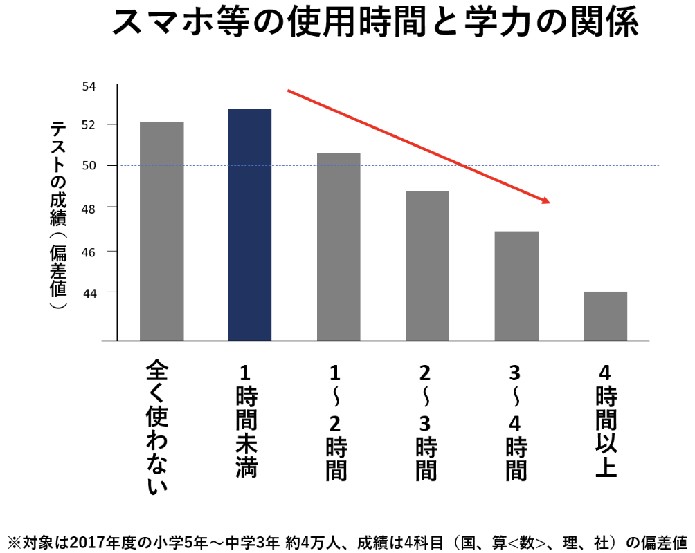
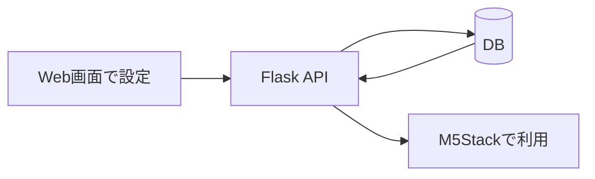

# 02. 課題と解決策

## 課題

ポモドーロタイマーやToDoアプリはスマートフォンで手軽に使えます。一方で、学習中にスマートフォンを開くと、通知、SNS、動画アプリなどに意識が移り、作業が中断されることがあります。

このプロジェクトでは、「スマートフォン上の学習支援アプリが便利である一方、スマートフォンを開くこと自体が集中を妨げる」という点を課題として捉えました。

元資料では、スマートフォン利用時間と学力の関係を示す参考画像も課題整理に利用しました。

## 解決策

TickStackでは、設定と利用の場面を分けました。

- 設定: Web画面でポモドーロ時間やToDoを登録する
- 利用: 学習中はM5Stack Core2でタイマーやToDoを確認する

## 目指した体験

- 学習開始前にWeb画面で必要な情報を登録する
- 学習中はM5Stackだけを見て時間やタスクを確認する
- スマートフォンを開くきっかけを減らす

定量的な効果測定は実施していないため、「集中時間が向上した」といった成果はこの公開版では記載していません。
