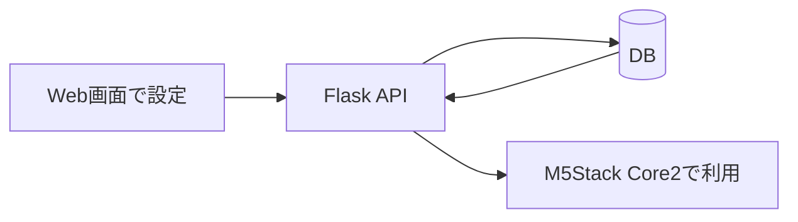

# 02. 課題と解決策

## 課題

ポモドーロタイマーやToDo管理は、学習効率の向上に役立つ手法として広く利用されています。現在では多くのアプリが提供されており、スマートフォン上で手軽に利用できます。

しかし、私たちは「学習支援機能そのもの」ではなく、「それらを利用するスマートフォンという環境」に課題があるのではないかと考えました。

学習中にスマートフォンでタイマーやToDoを確認すると、通知やSNS、動画アプリなどに意識が移り、作業が中断されることがあります。つまり、学習支援アプリは便利である一方、スマートフォンを開く行為そのものが集中を妨げるきっかけになり得ます。

そこで本プロジェクトでは、「学習支援機能を改善する」のではなく、「学習支援機能を利用する環境を改善する」ことを課題として設定しました。

元資料では、スマートフォン利用時間と学力の関係を示す参考資料も課題整理に利用しました。

---
## 解決策

TickStackでは、設定と利用の場面を分離する構成を採用しました。

- 設定：Web画面でポモドーロタイマーやToDoを登録する
- 利用：M5Stack Core2でタイマーやToDoを確認する

これにより、学習中にスマートフォンを開かなくても、学習に必要な情報へアクセスできる仕組みを目指しました。

Web画面で登録された設定やタスクはFlask APIを介してデータベースへ保存され、M5Stack Core2が必要な情報を取得して表示します。

---

## 目指した体験

ユーザーは学習開始前にWeb画面からタイマー設定やToDo登録を行います。

学習が始まった後は、M5Stack Core2上で時間やタスクを確認しながら作業を進めます。

これにより、学習中にスマートフォンを開く機会を減らし、学習に必要な情報だけへ集中できる環境を目指しました。

---

## 補足

定量的な効果測定は実施していないため、本ポートフォリオでは実装内容と設計上の狙いを中心に記載しています。
