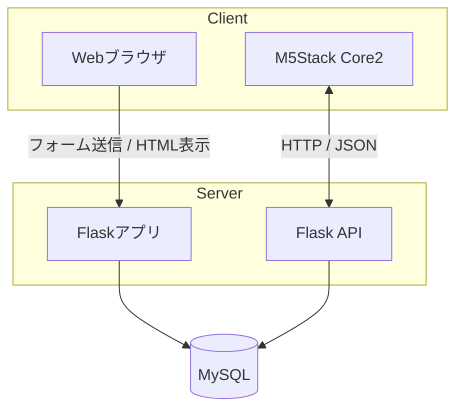

# 03. システム構成

## 全体構成



## Web側

Web側はFlaskとJinja2テンプレートで構成されています。ログイン後、ユーザーは以下を設定できます。

- ToDoの登録
- ToDoの完了・未完了切り替え
- 完了済みToDoの削除
- ポモドーロタイマーの作業時間・休憩時間の登録
- 使用するタイマー設定の選択
- M5StackのUID登録

## M5Stack側

M5Stack Core2側はMicroPythonで実装されています。HTTP通信でFlask APIにアクセスし、以下の情報を取得・送信します。

- UIDの紐づけ状態
- 選択されたタイマー設定
- 次に表示するToDo
- ToDo完了通知

## DB

公開コードではMySQLを利用しています。主なテーブルは以下です。

- `users`: WebユーザーとM5Stack UIDの管理
- `todos`: ユーザーごとのToDo
- `pomo_settings`: ユーザーごとのポモドーロ設定

## ディレクトリ構成

```text
.
├── api/                 # M5Stack向けAPI
├── clock/               # Flaskアプリ本体
│   ├── static/          # CSS / JS / 画像
│   └── templates/       # HTMLテンプレート
├── docs/                # 公開用ドキュメント
├── UIFlow/              # M5Stack側コード
├── Dockerfile
├── docker-compose.yml
├── init.sql
└── requirements.txt
```
