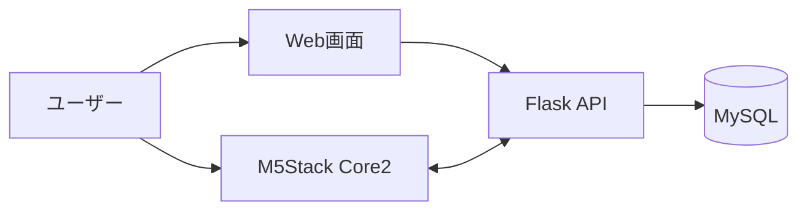

# 05. システム構成

## システム全体像

TickStackは、Web画面・Flask API・データベース・M5Stack Core2の4つの要素で構成されています。

---

## 各要素の役割

### Web画面

ユーザーが利用する管理画面です。

主な役割

- ポモドーロタイマー設定
- ToDo登録・編集
- ユーザー登録・ログイン
- M5Stack Core2との紐づけ

学習開始前の設定操作を担当します。

---

### Flask API

システム全体の中心となる役割を担います。

主な役割

- Web画面からのデータ保存
- M5Stackへのデータ提供
- ユーザー認証
- データ更新処理

Web画面とM5Stackが直接通信しないようにし、共通のインターフェースとして機能します。

---

### データベース

ユーザーごとの設定やタスク情報を保存します。

保存対象

- ユーザー情報
- ToDo情報
- タイマー設定
- M5Stack Core2との紐づけ情報

---

### M5Stack Core2

学習中に利用するデバイスです。

主な役割

- ポモドーロタイマー表示
- ToDo表示
- 時計表示
- 傾きによるモード切替

必要な情報をAPIから取得して表示します。

---

## API中心の構成を採用した理由

本プロジェクトでは、M5StackとWeb画面が同じデータを利用するため、両者の間にFlask APIを配置しました。

この構成により、

- Web側とM5Stack側を独立して開発できる
- データの取得方法を統一できる
- 将来的な機能追加が行いやすい

というメリットがあります。

また、チーム開発においてもAPI仕様を共有することで、担当ごとの並行開発を進めやすくなりました。

---

## 設定と利用を分離した理由

一般的な学習支援アプリでは、設定と利用の両方をスマートフォンで行います。

TickStackでは、

- 設定：Web画面
- 利用：M5Stack

に分離しました。

これにより、学習中にスマートフォンを開く機会を減らし、学習に必要な情報だけを確認できる環境を目指しました。
