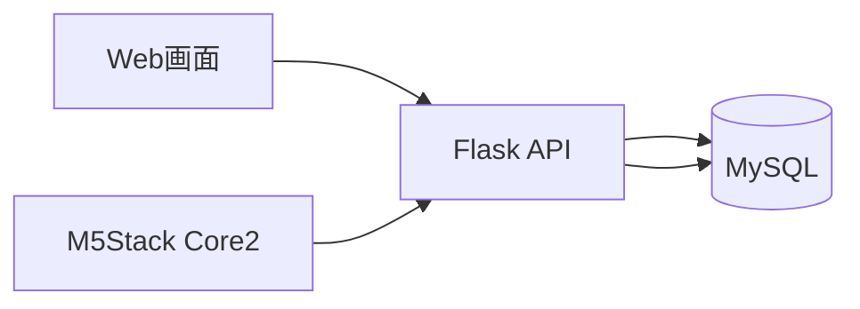

# 06. API設計

## APIを採用した理由

TickStackでは、Web画面とM5Stack Core2が同じデータを利用します。

そのため、両者が直接データベースへアクセスするのではなく、Flask APIを共通窓口として利用する構成を採用しました。

この構成により、

- Web担当
- バックエンド担当
- M5Stack担当

が共通のAPI仕様を前提として開発できるようになり、担当ごとの並行開発を進めやすくなります。

また、データの取得方法をAPIに集約することで、将来的な機能追加や内部実装の変更にも対応しやすい構成を目指しました。

---

## APIの利用イメージ

Web画面とM5Stackは共通のFlask APIを利用し、必要な情報を取得・更新します。

---

## Web画面向けルーティング

| Method | Path | 用途 |
|----------|----------|----------|
| GET / POST | /signup | ユーザー登録 |
| GET / POST | /login | ログイン |
| GET | /logout | ログアウト |
| GET | / | トップページ表示 |
| POST | /submit_uid | M5StackのUIDをログインユーザーへ紐づけ |
| GET | /todo | ToDo一覧表示 |
| GET | /todo/category/<category_id> | カテゴリ別ToDo一覧表示 |
| POST | /set_todo | ToDo登録 |
| POST | /todo/<todo_id>/status | ToDo状態更新 |
| POST | /todo/<todo_id>/delete | ToDo削除 |
| GET | /time | タイマー設定一覧表示 |
| POST | /set_timer | タイマー設定登録 |
| GET | /select_timer/<setting_id> | 使用するタイマー設定の選択 |
| POST | /delete_timer | タイマー設定削除 |

---

## M5Stack向けAPI

M5Stack側ではWebのログインセッションを保持しません。

そのため、デバイス固有のUIDを利用してユーザーとの紐づけを行い、必要なデータを取得する設計としました。

| Method | Path | 用途 | 主なレスポンス |
|----------|----------|----------|----------|
| GET | /api/timer_setting | UIDに紐づくタイマー設定取得 | work_time, break_time |
| GET | /api/uid_link_status | UIDの紐づけ状態確認 | linked |
| GET | /api/next_todo | 次の未完了ToDo取得 | id, title, duedate |
| POST | /api/next_todo | ToDo完了処理 | true / false |
| GET | /api | API疎通確認 | message |

---

## API設計で意識した点

### UIDによるユーザー識別

M5Stack側ではWebアプリのログインセッションを持たないため、デバイス固有のUIDを利用してユーザーとの紐づけを行いました。

これにより、M5Stackは認証処理を持たずに必要な情報だけを取得できるようになっています。

---

### M5Stack側の処理を単純化する

M5Stackは限られたリソース上で動作するため、取得するJSONの項目数を必要最小限に抑えました。

また、M5Stack側で複雑なデータ加工を行わずに利用できる形式を意識しました。

---

### 通信失敗への対応

Wi-Fi通信を利用するため、一時的な通信失敗が発生する可能性があります。

そのため、通信失敗時でもデバイス側が停止しないよう、デフォルト値を利用して処理を継続できる設計を採用しました。

---

## API設計がチーム開発に与えた効果

本プロジェクトでは、

- Web担当
- バックエンド担当
- M5Stack担当

が並行して開発を進めていました。

API仕様を事前に整理することで、

- 担当ごとの認識ずれを減らす
- 手戻りを減らす
- 独立して開発を進める

ことが可能になりました。

結果として、システム全体の開発効率向上につながりました。

---

## 今後改善したい点

### HTTPメソッドの見直し

/select_timer/<setting_id> はデータベース更新を伴うため、本来はGETではなくPOSTを利用すべきでした。

RESTの考え方に沿った設計へ改善したいと考えています。

---

### バリデーション強化

現在は主に画面側で入力チェックを行っています。

今後はバックエンド側でも入力値の範囲チェックや不正値検証を行い、安全性を向上させたいと考えています。

---

### API仕様の早期固定

開発初期はAPI仕様が変化する場面がありました。

今後は、開発開始前にAPI仕様をより詳細に定義し、担当間の認識ずれや手戻りをさらに減らしたいと考えています。
