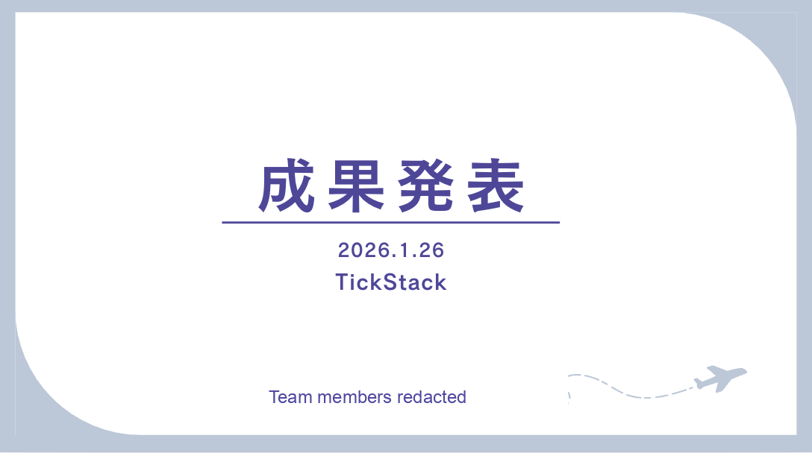
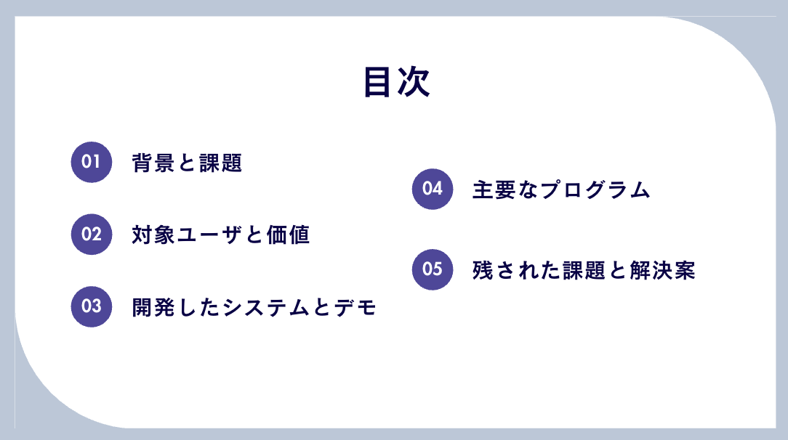
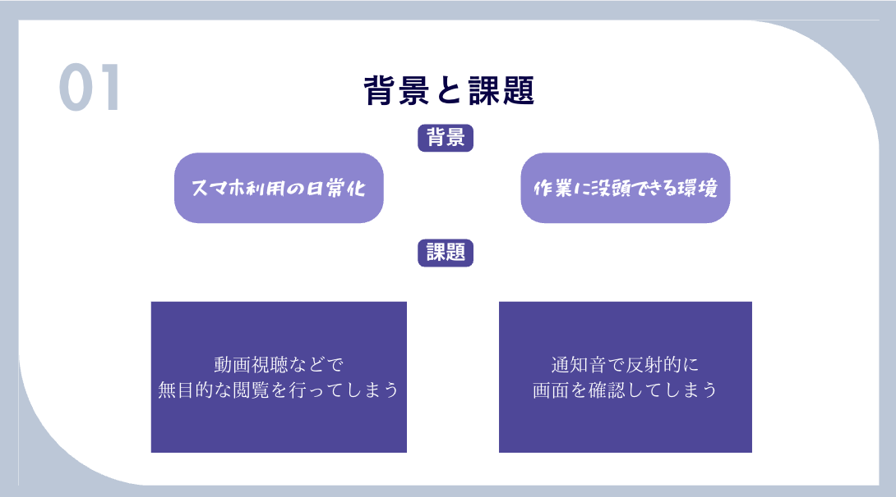
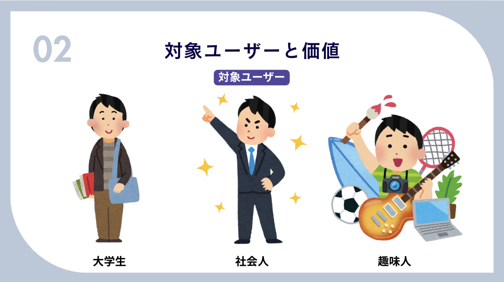
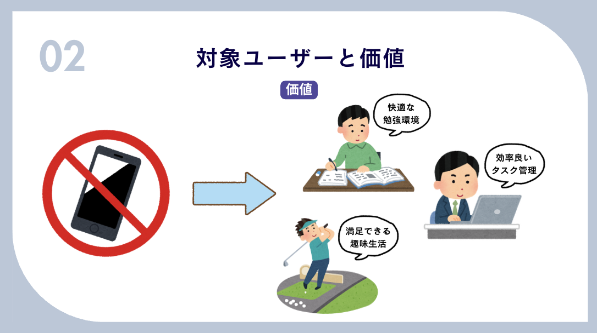
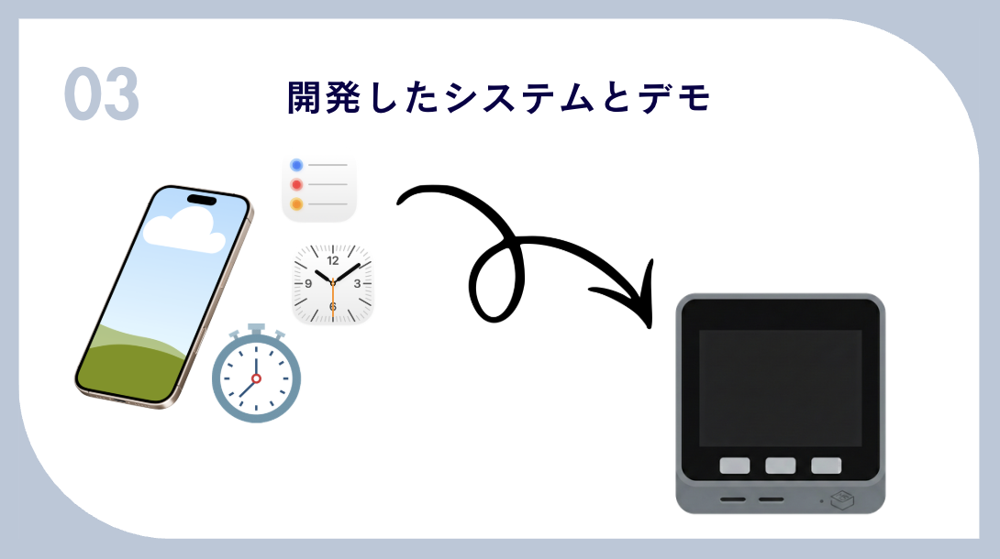
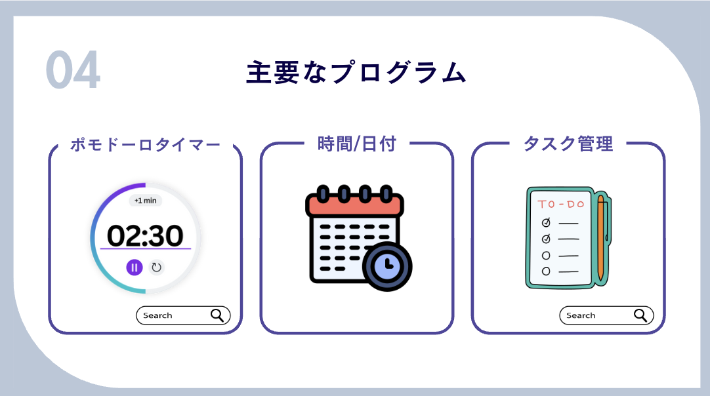

# 08. 発表資料・報告書アーカイブ

このページは、元のチーム開発資料をポートフォリオ向けに整理したものです。学籍番号、メンバー実名、一部アカウント名は伏せ字化しています。未測定の定量成果表現は、公開版では削除または弱めています。

## 成果発表スライド

成果発表で使用したスライド画像です。表紙に含まれていたメンバー名は画像上で伏せています。

| No. | 内容 | 画像 |
|---|---|---|
| 1 | 表紙 |  |
| 2 | 目次 |  |
| 3 | 背景と課題 |  |
| 4 | 対象ユーザー |  |
| 5 | 提供価値 |  |
| 6 | 開発したシステム |  |
| 7 | 主要なプログラム |  |

## 発表スライド補足

- [表紙スライド](assets/slides/slide_cover_redacted.png)
- [目次スライド](assets/slides/slide_toc.png)
- [課題整理スライド](assets/slides/slide_problem.png)

## 参考資料

- [アイデアシート PDF](assets/reference/ideasheet.pdf)
- [アイデアシート プレビュー](assets/reference/ideasheet-preview.png)
- [開発時のシステム構成図](assets/reference/systemdiagram.png)
- [スマホ等の使用時間と学力の関係](assets/reference/smartphone-study-reference.png)

## 報告書アーカイブ

元の提出資料を、公開用に伏せ字化したMarkdownです。文章は当時の資料の雰囲気を残しつつ、個人情報と未検証の定量成果表現を整理しています。

- [後期中間レポート / SIP1](archive/final_report_sip1_redacted.md)
- [最終報告書 / SIP2](archive/final_report_sip2_redacted.md)
- [中間報告 / SIP1](archive/midterm_report_sip1_redacted.md)
- [中間報告 / SIP2](archive/midterm_report_sip2_redacted.md)

## 週報アーカイブ

チーム開発中の進捗管理の記録です。就活ポートフォリオとしては、リーダーとしての課題把握、役割調整、仕様調整の過程を補足する資料として位置づけています。

- [週報 2025-09-22](archive/weekly_status_2025-09-22_redacted.md)
- [週報 2025-11-17](archive/weekly_status_2025-11-17_redacted.md)
- [週報 2026-01-19](archive/weekly_status_2026-01-19_redacted.md)
- [週報 メンバーC](archive/weekly_status_member_c_redacted.md)
- [週報 メンバーD](archive/weekly_status_member_d_redacted.md)
- [週報 メンバーE](archive/weekly_status_member_e_redacted.md)
