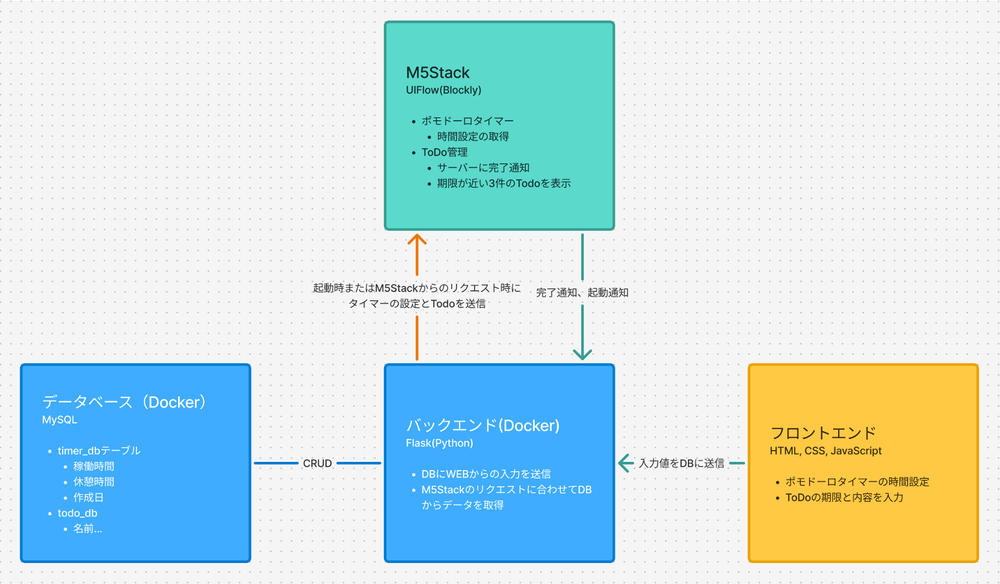
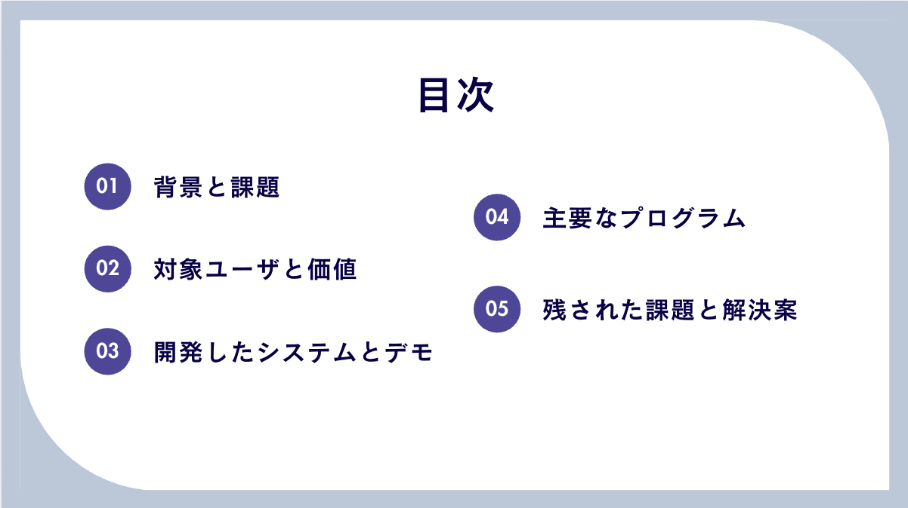

<!-- このファイルは元の提出資料をポートフォリオ公開用に伏せ字化したものです。学籍番号・実名・一部アカウント名は非公開化し、未測定の定量成果表現は削除または弱めています。 -->

# 後期中間レポート

## 1. チームの情報と役割
- **チーム名**：6班
- **メンバーと役割**
  - **メンバーA（リーダー / 本人）**（リーダー）
    班全員の進捗度、毎回の問題点、その改善点を毎授業確認し、漏れがないか・間に合うのかを把握。各メンバーのシステム機能同士がぶつかり合わないよう調整しながら進行。
  - **メンバーB（サブリーダー）**（サブリーダー）
    リーダーが休んだ時に代行してチームをまとめる。リーダーが見落とした点について助言・サポートし、負担の重いメンバーの作業を分担して支援。
  - **メンバーC（Web担当）**
    HTML/CSSを使ってページを作成。Flask APIへのデータ送信機能と、Flask APIから受信したデータを画面に表示する機能を実装。
  - **メンバーD（バックエンド担当）**
    Dockerによる開発環境構築。M5Stack用ポモドーロタイマー設定を保存するデータベース設計・実装。ToDo用テーブル追加と、Web・M5Stack間の連携コード作成。
  - **メンバーE（M5Stack開発）**
    M5Stack上でのポモドーロタイマーとタイマー表示、モード切り替え、Wi-Fi通信設定のテスト。Flask APIから送られるワークタイム／ブレイクタイムの値受け渡し検証。

## 2. 開発するものの概要
- **2.1対象ユーザとアプリ概要**
* 対象ユーザ： 勉強中にスマホを使ってしまい集中できずに困っている大学生がメイン層である。またモード変更により対象者が趣味を没頭したい人、仕事を集中してしたい人に広がる。
* 解決したい課題： 総務省「令和4年情報通信白書」によると、10代から30代におけるスマートフォンの保有率は90％を超えている。特に大学生を含む若年層では、ほぼ全員がスマートフォンを所持し、1時間に1回以上の頻度でSNS（LINE、Instagram、X）や動画配信アプリ（YouTube、TikTok）を利用している。また、NTTドコモ モバイル社会研究所による「インターネット利用時間に関する調査」（2025年2月）では、18～22歳の平均スマートフォン利用時間は1日あたり7.8時間に達し、そのうち2～3時間は特定の目的を持たずにSNSや動画を閲覧していることが報告されている。さらに、通知音が鳴ると反射的に画面を確認してしまうといった“無意識使用”も多く見られ、若年層のスマートフォン依存傾向が顕著になっている。このような現状から、スマートフォンを長時間・無意識に使用し続けてしまうという課題を解決する必要がある。
* 得られる価値：スマートフォンからの通知・SNS・動画などによる注意の分散を防ぎ、ユーザーが「今やるべきこと」だけに意識を集中できる環境を提供する。ポモドーロタイマーとToDo管理をM5Stack上で完結させることで、
* 作業中のアプリ切替・通知チェックといった作業中断要因を最小化できる。
* アプリ概要：本システムは、M5Stackを活用した作業集中支援ツールである。
近年、大学生を中心とする若年層ではスマートフォンの長時間利用や無意識的な操作が増加しており、学習や作業中の集中力低下が課題となっている。
本ツールは、スマートフォンの煩わしさから一時的に距離を置きつつ、作業に必要な最低限の機能のみを提供することで、作業中に必要な情報へアクセスしやすくすることを目指す。
- **UIと主要な機能**
  1. ポモドーロタイマー
    * 機能詳細：
        * 「25分の集中作業＋5分間の休憩」を自動切替。 (ユーザーはウェブサイトから作業時間と休憩時間を設定できる)
        * M5Stack画面内のスタートボタンを押すことでで開始／停止、同じく画面内のリセットボタンを押すことでリセットを行う。
        * 画面中央に大きくデジタルカウントダウンを表示し、残り時間を確認可能。
    * ユーザーへの効果：
        * スマホを操作せずに簡単に時間管理ができ、通知や別アプリへの切替による集中の中断を防止。
        * 残り時間を視覚的に把握できるため、作業への没入度が向上し、集中の維持を支援することを目指した。
2. ToDo同期表示
    * 機能詳細：
        * スマホ／PCから専用ウェブサイトでタスクを登録・編集。
        * ウェブサイトから未完了タスク上位3件をM5Stackに送信し、M5Stack画面にリアルタイムに表示。
        * M5Stack画面内のチェックボタンから完了タスクを選択し、画面内Doneボタンで完了操作 → 完了情報をFlask APIへ即時送信。
    * ユーザーへの効果：
        * スマホを開かずに「今やるべきタスク」を手元で確認・操作でき、大量情報による気散りを防止する。
画面レイアウト：
* メイン画面：大きな残り時間表示＋モード表示＋開始／停止ボタン

2. ToDo画面：タスクタイトル＋締切日時×3件＋完了ボタン

* 設定画面：集中／休憩時間設定＋Wi-Fiステータス

* ToDoのホーム画面:設定とタイマー周期設定の移動ボタン+説明
  

## 3. 提案システムの概要
- **システム名**：FocusM5
- **主な機能**：
  本システムはM5Stackを活用した作業集中支援ツール。大学生など若年層がスマホの煩わしさから一時的に距離を置き、必要最低限の機能のみアクセスできる環境を提供し、作業の進めやすさを支援する。
  以下は具体的な機能一覧である。

1. **ポモドーロタイマー**
    - **機能詳細**：
       - 「25分の集中作業＋5分間の休憩」を自動切替。 (ユーザーはウェブサイトから作業時間と休憩時間を設定できる)
       - M5Stack画面内のスタートボタンを押すことでで開始／停止、同じく画面内のリセットボタンを押すことでリセットを行う。
       - 画面中央に大きくデジタルカウントダウンを表示し、残り時間を確認可能。
    - **ユーザーへの効果**：
       - スマホを操作せずに簡単に時間管理ができ、通知や別アプリへの切替による集中の中断を防止。
       - 残り時間を視覚的に把握できるため、作業への没入度が向上し、集中の維持を支援することを目指した。

 2. **ToDo同期表示**
     - **機能詳細**：
       1. スマホ／PCから専用ウェブサイトでタスクを登録・編集。
       2. ウェブサイトから未完了タスク上位3件をM5Stackに送信し、M5Stack画面にリアルタイムに表示。
       3. M5Stack画面内のチェックボタンから完了タスクを選択し、画面内Doneボタンで完了操作 → 完了情報をFlask APIへ即時送信。
     - **ユーザーへの効果**：
       - スマホを開かずに「今やるべきタスク」を手元で確認・操作でき、大量情報による気散りを防止する。

 3. **物理フィードバック**
     - **機能詳細**：
       - タイマー終了やタスク完了時にブザーまたは振動で通知
     - **ユーザーへの効果**：
       - 視覚に頼らない聴覚・触覚のフィードバックで、注意をそらさずに次の行動へスムーズに移行。

- **画面レイアウト**：
  1. メイン画面：大きな残り時間表示＋モード表示＋開始／停止ボタン
    
  2. ToDo画面：タスクタイトル＋締切日時×3件＋完了ボタン
      

  3. 設定画面：集中／休憩時間設定＋Wi-Fiステータス
    
    

- **システム構成図**：

## 4. 進捗状況
- **何がどれだけ終わっているか**
- Docker環境構築：完了
- データベース設計・実装：完了
- Flask API 基本機能：実装済み
- M5Stack ポモドーロタイマー表示：動作テスト完了
- ToDo同期表示の基本動作：確認済み
- ガンツチャート
- 

- **技術調査の結果**
- M5Stack（ESP32ベース）のWi-Fi・GPIO制御
- Flask／SQLAlchemy を用いた軽量API
- Docker Compose による開発環境再現性確保

## 5. 後期の作業予定と把握しているリスク
- **後期の作業予定**
- 8月上旬：ToDo完了同期の安定化テスト
- 8月中旬：UI調整・ユーザーテスト準備
- 9月上旬：ユーザーテスト実施・フィードバック反映
- 9月中旬：最終ドキュメント作成

- **把握しているリスク**
- Wi-Fi通信の不安定 → リトライ処理／HTTPフォールバック実装
- M5Stackのバッテリー消費 → 画面輝度制御／スリープモード活用
- バックエンド高負荷時の応答遅延 → キャッシュ導入／ワーカー数調整

## 参考文献
- 総務省「令和4年情報通信白書」
- NTTドコモ モバイル社会研究所「インターネット利用時間に関する調査」（2025年2月）
- TickTime Pro 製品ページ（https://tinyurl.com/pomodorosim1）
- KLOCKIS クロッキス 製品ページ (https://www.ikea.com/jp/ja/p/klockis-clock-thermometer-alarm-timer-white-50596154/)
- モバイル社会研究所 (https://www.moba-ken.jp/project/lifestyle/20250221.html)
- The Cost of Interrupted Work: More Speed and Stress　(https://ics.uci.edu/~gmark/chi08-mark.pdf)
