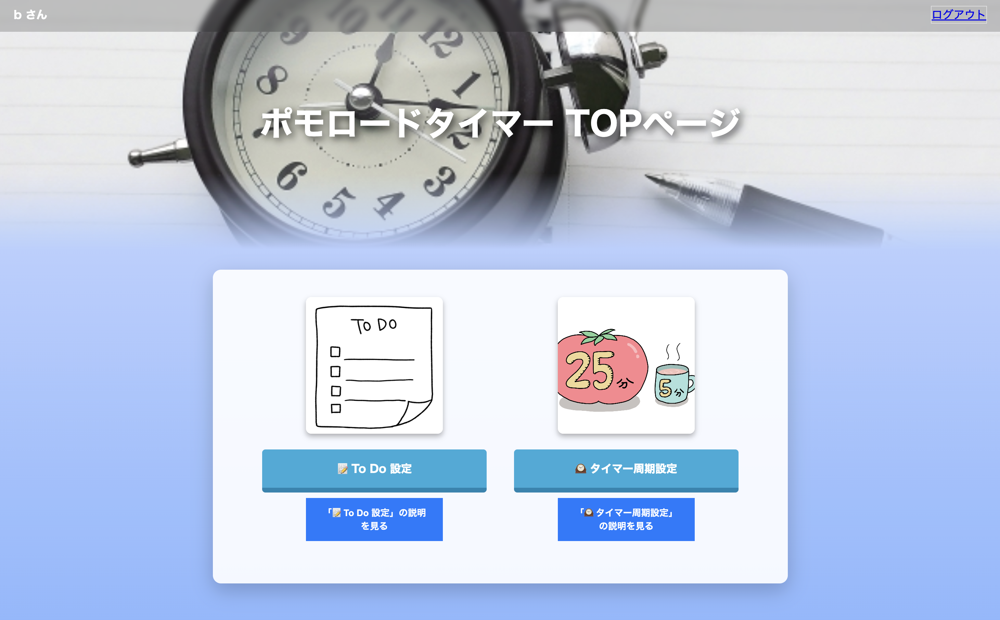
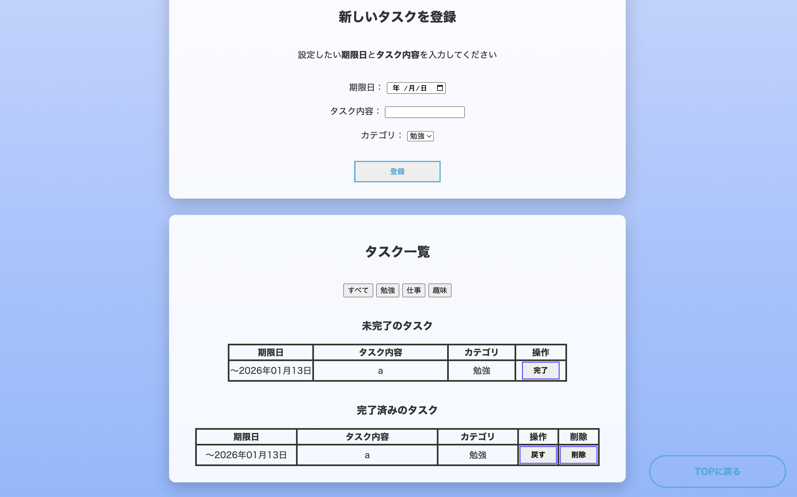
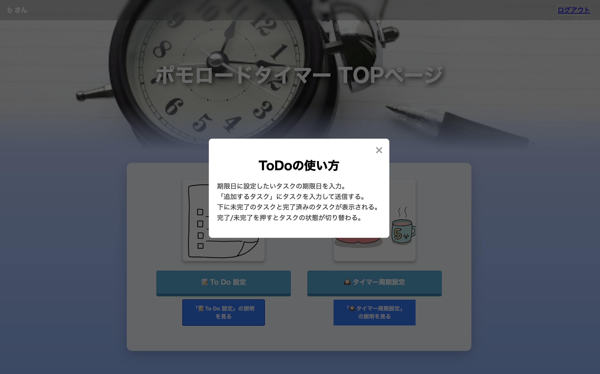
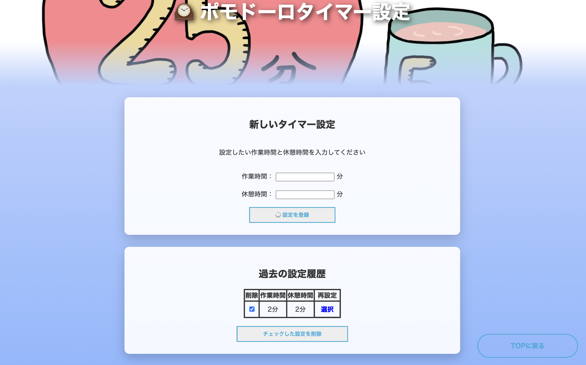
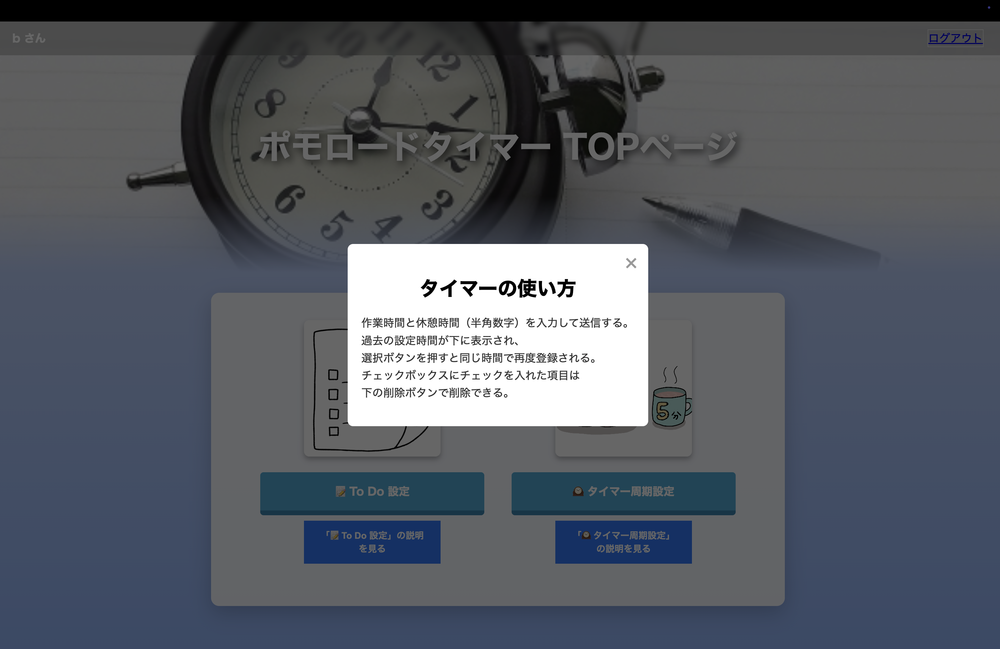

<!-- このファイルは元の提出資料をポートフォリオ公開用に伏せ字化したものです。学籍番号・実名・一部アカウント名は非公開化し、未測定の定量成果表現は削除または弱めています。 -->

# 最終報告書の記載ガイドライン
## 1. チーム情報と役割
- チーム名：６班
- メンバーと役割：
  - メンバーA（リーダー / 本人）（リーダー）
  - メンバーB（サブリーダー）（サブリーダー）
  - メンバーC（Web担当）
  - メンバーD（バックエンド担当）
  - メンバーE（M5Stack開発）

## 2. プロジェクト概要
* 対象ユーザ： 学習・仕事・趣味など、集中して作業に取り組みたい人を対象としている。 現代社会では、年齢や職業を問わず多くの人がスマートフォンを日常的に利用しており、その存在自体が集中を妨げる原因となっている。 ある研究では「画面を消した他人の携帯電話であっても，ただそばに置いてあるだけで注意が損なわれることがわかりました。特に，普段は携帯電話を使わない人ほどこの影響が強い傾向にありました」 と報告をされている。 このように通知やSNS、動画コンテンツによって注意が分散しやすい環境にある。このように、長時間デスクワークや勉強、作業を行う学生・社会人にとって、集中を持続することは共通の課題である。 本アプリは、こうした課題を抱える幅広いユーザに対し、「作業に没頭できる環境」を提供することを目的としている。
* 解決したい課題： 総務省「令和4年情報通信白書」によると、10代から30代におけるスマートフォンの保有率は90％を超えており、 SNSや動画配信サービスの利用が日常化している。 また、NTTドコモ モバイル社会研究所の調査では、18～22歳の平均スマートフォン利用時間が1日7.8時間に達し、そのうち相当時間が“無目的な閲覧”に費やされていることが報告されている。 さらに、同研究所の別の調査では、「10代女性の7割が「スマホに通知が来ていないか、ついつい確認してしまう」と報告されている。 このように、通知音が鳴ると反射的に画面を確認してしまうといった無意識的な使用行動は幅広い年代で見られ、スマートフォンへの依存傾向が社会全体に広がっている。
* 得られる価値：スマートフォンからの通知・SNS・動画などによる注意の分散を防ぎ、ユーザーが「今やるべきこと」だけに意識を集中できる環境を提供する。 ポモドーロタイマーとToDo管理をM5Stack上で完結させることで、作業中のアプリ切替・通知チェックといった作業中断要因を最小化できる。
* アプリ概要：本アプリは、M5Stackを活用した作業集中支援ツールである。 本体を傾けるだけで「ポモドーロタイマー」「ToDo同期表示」「現在時刻表示」などのモードを直感的に切り替えられる。 スマートフォンやクラウドサービスと連携してタスク情報を同期しつつ、作業中は通知やSNSからの誘惑を遮断することで、ユーザーが作業に没頭できる環境を提供する。 学習者・社会人・クリエイターなど、集中を必要とする多様なユーザーに向けた“スマートフォンに頼らない集中デバイス”として設計している。

## 3. プロジェクトの成果物
### 3.1 UI と主要な機能
1. ポモドーロタイマー
    * 機能詳細：
        * ポモドーロタイマーの作業時間と休憩時間の切替。 (ユーザーはウェブサイトから変更が可能)
        * M5Stack画面内のスタートボタンを押すことで開始／停止、同じく画面内のリセットボタンを押すことでリセットを行う。
        * 画面中央に大きくカウントダウンを表示し、残り時間を確認可能。
    * ユーザーへの効果：
        * スマホを操作せずに簡単に時間管理ができ、通知や別アプリへの切替による集中の中断を防止。
        * 残り時間を視覚的に把握できるため、作業への没入度が向上し、集中の維持を支援することを目指した。
2. ToDo同期表示
    * 機能詳細：
        * スマホ／PCから専用ウェブサイトでタスクを登録・編集。
        * ウェブサイトから未完了タスク上位3件をM5Stackに送信し、M5Stack画面にリアルタイムに表示。
        * M5Stack画面内のチェックボタンから完了タスクを選択し、画面内Doneボタンで完了操作 → 完了情報をFlask APIへ即時送信。
    * ユーザーへの効果：
        * スマホを開かずに「今やるべきタスク」を手元で確認・操作でき、大量情報による気散りを防止する。
UI 概要
本システムは、使用者が勉強中などでパパッと使いたいときに使えるようにしたいので、画面は見やすく、必要な入力しか要求するようにする。主要な画面は以下のもので構成される：
主要機能と課題解決への寄与
* (1) メイン画面：大きな残り時間表示＋モード表示＋開始／停止ボタン
    * 電源を入れたときに表示される画面。他のものに目線が映らないように必要最低限なものしかボタンはない。
    
* (2) M5Stack側のToDo画面: ToDo画面+チェックマーク+完了ボタン
	何が終わったのか選択する画面。
  	
* (3) ToDo画面(新しいタスクの登録)：期限日設定+タスク内容+カテゴリ+登録ボタン
	
タスク一覧（未完了のタスク、完了済みのタスク）の確認画面
 	
ToDoの使い方の説明画面
	
* (4)ポモドーロタイマー設定画面（新しいタイマー設定）：作業時間、休憩時間入力ボタン+登録ボタン
  	
過去の設定履歴確認画面+削除ボタン
	
ポモドーロタイマーの使い方説明画面
	

### 3.2 残った課題と解決案
swingを使ったスマホアプリを作成できなかったこと

表1: 課題と解決案の整理
| 課題 | 現状の問題点 | 完成しなかった理由／不十分な理由 | 改善案（今後の方針） |
|------|--------------|----------------------------------|-------------------------|
|差別化の案としてswingを使ってアプリ化すると言うことができなかったこと|swingの学習量が不十分|案が出る時期が遅かったこと|早めに考えるように意識する|

# 4. プロジェクトの進行

## 4.1 全体的な進行の感想
今回、班で協力してM5Stackを使い、一年間で一つの作品を作るという授業を受けてみて思ったことは、うまくいかなかったことがいっぱいあるがその分協力して一つのでかいものを作る楽しさを学んだ。初めは顔も知らない人とやっていくのは不安しかなかったがどんどん授業を受けていく中で班のメンバー一人一人が違う、とてもすごい能力を持っていて自分の知らなかったことなどをメンバーから学べたりしてとてもいい経験になったなと思う。全体的に見ればいいとこは少ないかも知れないがこの一年間で出てきた課題をちょっとずつでもいいので解消していけたらなと思う。協力してでかいものを作り完成した時はとてもやりがいや嬉しさが込み上げてきた。

## 4.2 担当者と貢献したこと
- メンバーA（リーダー / 本人）（リーダー）:
班全員の進捗度、毎回の問題点、その改善点を毎授業確認し、漏れがないか・間に合うのかを把握。各メンバーのシステム機能同士がぶつかり合わないよう調整しながら進行。
- メンバーB（サブリーダー）（サブリーダー）:
リーダーが休んだ時に代行してチームをまとめる。リーダーが見落とした点について助言・サポートし、負担の重いメンバーの作業を分担して支援。
- メンバーC（Web担当）:
HTML/CSSを使ってページを作成。Flask APIへのデータ送信機能と、Flask APIから受信したデータを画面に表示する機能を実装。
- メンバーD（バックエンド担当）:
Dockerによるチーム内の開発環境構築。M5Stack用ポモドーロタイマー設定を保存するデータベース設計・実装。Web・M5Stack間の連携コード作成。
- メンバーE（M5Stack開発）
M5Stack上でのポモドーロタイマーとタイマー表示、モード切り替え、Wi-Fi通信設定のテスト。Flask APIから送られるワークタイム／ブレイクタイムの値受け渡し検証。

# 5. 参考リスト
* TickTime Pro 製品ページ（https://tinyurl.com/pomodorosim1）
* KLOCKIS クロッキス 製品ページ (https://www.ikea.com/jp/ja/p/klockis-clock-thermometer-alarm-timer-white-50596154/)
* モバイル社会研究所 (https://www.moba-ken.jp/project/lifestyle/20250221.html)
* The Cost of Interrupted Work: More Speed and Stress　(https://ics.uci.edu/~gmark/chi08-mark.pdf)
1. 伊藤資浩, 河原純一郎. 携帯電話が単に置いてあることが空間的視覚探索に及ぼす影響. Japanese Psychological Research.2016, Vol.59, No.2 ↩
2. 総務省「情報通信に関する現状報告の概要」https://www.soumu.go.jp/johotsusintokei/whitepaper/ja/r04/html/nb000000.html (2025年10月) ↩
3. NTTドコモ モバイル社会研究所「インターネット利用時間、10代・20代は1日平均7.3～7.7時間」https://www.moba-ken.jp/project/lifestyle/20250221.html（2025年10月） ↩
4. NTTドコモ モバイル社会研究所「スマホに通知が来ていないか、ついつい確認してしまう：10代女性の7割」https://www.moba-ken.jp/project/lifestyle/20240321.html (2025年11月) ↩
