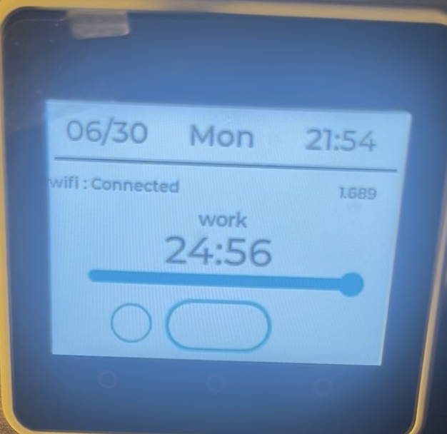
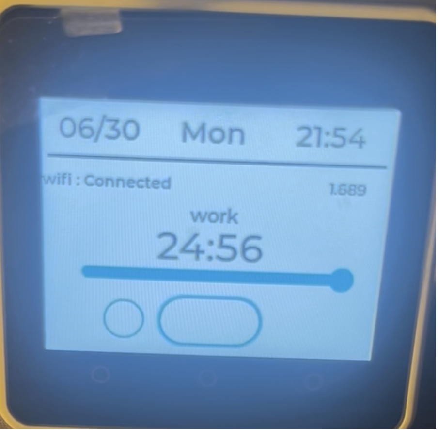
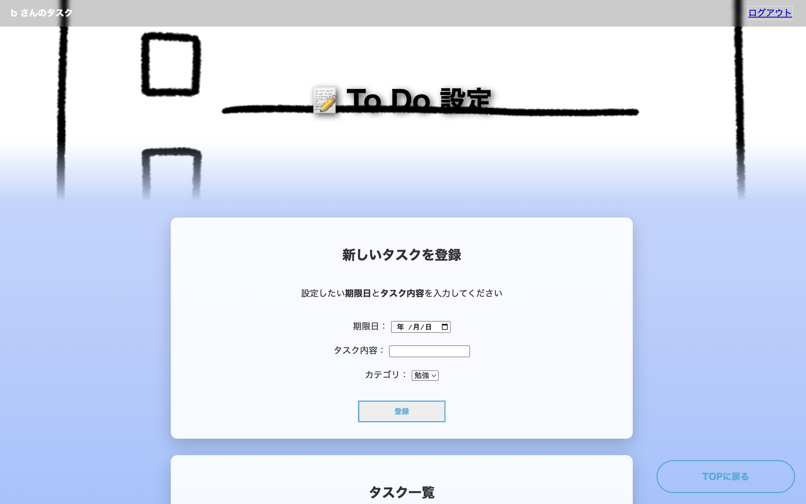
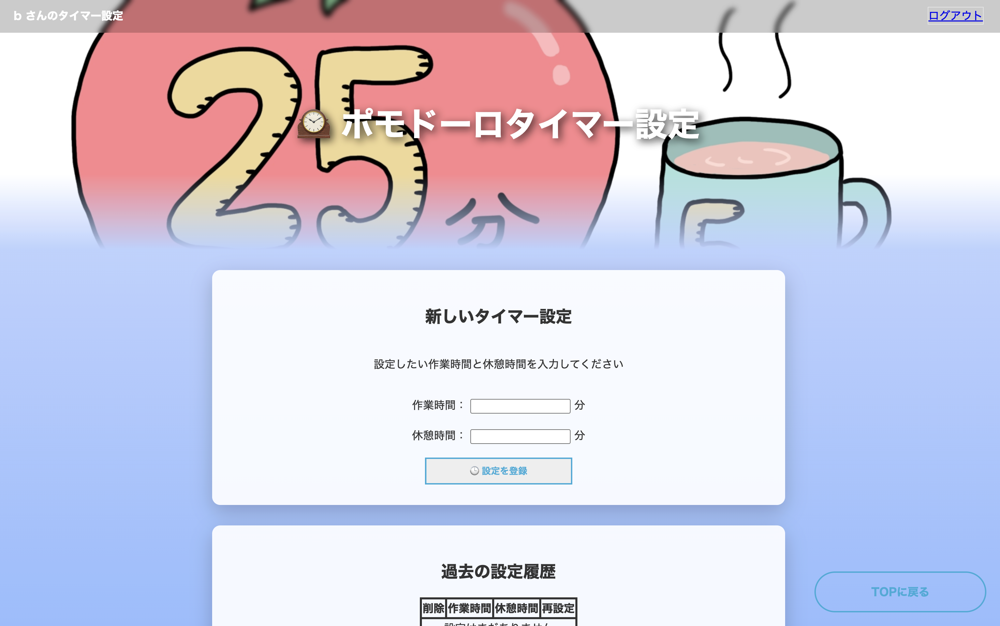

<!-- このファイルは元の提出資料をポートフォリオ公開用に伏せ字化したものです。学籍番号・実名・一部アカウント名は非公開化し、未測定の定量成果表現は削除または弱めています。 -->

# 社会情報学実習2　中間報告書

## 1. チームの情報と役割
- **チーム名**：6班  
- **メンバーと役割**  
  - **メンバーA（リーダー / 本人）**（リーダー）  
    班全員の進捗度、毎回の問題点、その改善点を毎授業確認し、漏れがないか・間に合うのかを把握。各メンバーのシステム機能同士がぶつかり合わないよう調整しながら進行。  
  - **メンバーB（サブリーダー）**（サブリーダー）  
    リーダーが休んだ時に代行してチームをまとめる。リーダーが見落とした点について助言・サポートし、負担の重いメンバーの作業を分担して支援。  
  - **メンバーC（フロントエンド）**（フロントエンド）  
    HTML/CSSを使ってページを作成。Flaskサーバーへのデータ送信機能と、サーバーから受信したデータを画面に表示する機能を実装。  
  - **メンバーD（サーバー開発）**（サーバー開発）  
    Dockerによるチーム内の開発環境構築。M5Stack用ポモドーロタイマー設定を保存するデータベース設計・実装。フロントエンド・M5Stack間の連携コード作成。
  - **メンバーE（M5Stack開発）**（M5Stack開発）  
    M5Stack上でのポモドーロ機能とタイマー表示、モード切り替え、Wi-Fi通信設定のテスト。サーバーから送られるワークタイム／ブレイクタイムの値受け渡し検証。  

## 2. 開発するものの概要

### 2.1対象ユーザーとアプリ概要
  - 対象ユーザ： 学習・仕事・趣味など、集中して作業に取り組みたい人を対象としている。
  現代社会では、年齢や職業を問わず多くの人がスマートフォンを日常的に利用しており、その存在自体が集中を妨げる原因となっている。
  ある研究では<u>「画面を消した他人の携帯電話であっても，ただそばに置いてあるだけで注意が損なわれることがわかりました。特に，普段は携帯電話を使わない人ほどこの影響が強い傾向にありました」[^1]:</u> と報告をされている。
  このように通知やSNS、動画コンテンツによって注意が分散しやすい環境にある。このように、長時間デスクワークや勉強、作業を行う学生・社会人にとって、集中を持続することは共通の課題である。
  本アプリは、こうした課題を抱える幅広いユーザに対し、「作業に没頭できる環境」を提供することを目的としている。
  - 解決したい課題： 総務省「令和4年情報通信白書」によると、10代から30代におけるスマートフォンの保有率は90％を超えており、[^2]: SNSや動画配信サービスの利用が日常化している。
  また、NTTドコモ モバイル社会研究所の調査では、18～22歳の平均スマートフォン利用時間が1日7.8時間に達し、そのうち相当時間が“無目的な閲覧”に費やされていることが報告されている[^3]:。
  さらに、同研究所の別の調査では、「10代女性の7割が「スマホに通知が来ていないか、ついつい確認してしまう」と報告されている[^4]:。
  このように、通知音が鳴ると反射的に画面を確認してしまうといった無意識的な使用行動は幅広い年代で見られ、スマートフォンへの依存傾向が社会全体に広がっている。
  - 得られる価値：スマートフォンからの通知・SNS・動画などによる注意の分散を防ぎ、ユーザーが「今やるべきこと」だけに意識を集中できる環境を提供する。
  ポモドーロタイマーとタスク管理をM5Stack上で完結させることで、作業中のアプリ切替・通知チェックといった作業中断要因を最小化できる。
  - アプリ概要：本アプリは、M5Stackを活用した作業集中支援ツールである。
  本体を傾けるだけで「ポモドーロタイマー」「ToDo同期表示」「現在時刻表示」などのモードを直感的に切り替えられる。
  スマートフォンやクラウドサービスと連携してタスク情報を同期しつつ、作業中は通知やSNSからの誘惑を遮断することで、ユーザーが作業に没頭できる環境を提供する。
  学習者・社会人・クリエイターなど、集中を必要とする多様なユーザーに向けた“スマートフォンに頼らない集中デバイス”として設計している。

### 2.2 UIと主要な機能  
1. ポモドーロタイマー  
   * 機能詳細：
      * ポモドーロタイマーの作業時間と休憩時間の切替。 (ユーザーはウェブサイトから変更が可能)  
      * M5Stack画面内のスタートボタンを押すことで開始／停止、同じく画面内のリセットボタンを押すことでリセットを行う。
      * 画面中央に大きくカウントダウンを表示し、残り時間を確認可能。  
   * ユーザーへの効果：  
       * スマホを操作せずに簡単に時間管理ができ、通知や別アプリへの切替による集中の中断を防止。  
       * 残り時間を視覚的に把握できるため、作業への没入度が向上し、集中の維持を支援することを目指した。  

2. ToDo同期表示  
   * 機能詳細：  
       * スマホ／PCから専用ウェブサイトでタスクを登録・編集。  
       * ウェブサイトから未完了タスク上位3件をM5Stackに送信し、M5Stack画面にリアルタイムに表示。  
       * M5Stack画面内のチェックボタンから完了タスクを選択し、画面内Doneボタンで完了操作 → 完了情報をサーバーへ即時送信。  
   * ユーザーへの効果：  
       * スマホを開かずに「今やるべきタスク」を手元で確認・操作でき、大量情報による気散りを防止する。  

画面レイアウト：  
* メイン画面：大きな残り時間表示＋モード表示＋開始／停止ボタン

* M5stack側のTodo画面:todo画面+チェックマーク+完了ボタン

* ToDo画面：タスクタイトル＋締切日時×3件＋完了ボタン  

* 設定画面：集中／休憩時間設定＋Wi-Fiステータス

## 3.進捗状況
### 3.1. 何がどれだけ終わっているか
| 項目/機能      | 概要                     | 担当 | 状況 | 進捗 | 備考 |
|----------------|--------------------------|------|------|------|------|
| TOPページ（フロント） | 機能ごとのページへの遷移、それらの紹介 | メンバーC | 完了 | 100%  | 各機能のページへの遷移ボタン/各機能の説明用ポップアップ（モーダル）の作成完了 |
| ポモドーロタイマー（フロント） | 作業時間・休憩時間の登録 | メンバーC | 進行中 | 80%  | 作業時間・休憩時間の登録/過去設定の削除機能は完成、再設定ボタン未完成 |
| ToDoリスト（フロント） | タスクの名前と期限日、カテゴリの設定 | メンバーC | 進行中 | 80%  | タスク名・期限日・カテゴリの登録/完了・未完了の変更/完了タスクの削除完成、カテゴリごとに分けて表示する機能未完成 |
| 時計表示画面(m5Stack）| どのモードの画面でも日付と時間を表示| メンバーE | 完了| 100% | 日付・時間表示をどの画面からでも確認できるようにレイアウトを変更し、完成。 |
| ポモドーロタイマー（m5Stack）| 設定したwork時間とbreak時間を切り替え、繰り返しカウントダウンする。| メンバーE | 進行中 | 95％ | カウントダウンの再生・停止・リセットのボタンのデザイン表示の方法を模索中 |
| ToDoリスト（m5Stack）| サーバから取得したToDoリストから内容と期限を表示し、達成の可否を行う | メンバーE | 進行中 | 70% | サーバとの通信機能が未完成 |
| UIデザイン（m5Stack）| m5Stackの各アクション時における視覚的デザイン| メンバーE | 進行中 | 80% | ポモドーロのworkとbreakの切り替え時やToDo達成時などの色覚的なデザインが未完成 |
| M5Stackとのデータの受け渡し | ポモドーロタイマー設定、期限の最も近いToDo | メンバーD | 進行中 | 90% | 必要に応じて随時追加 |
| WEBサイトとのデータの受け渡し | タイマー設定とToDoの追加、削除、更新 | メンバーD | 進行中 | 90% | 必要に応じて随時追加 |
| デプロイ | pythonanywhereを使用 | メンバーD | 完了 | 100% | 3ヶ月に一回pythonanywhereにログインする |
| Dockerによるローカルの環境構築 | webコンテナ、dbコンテナが存在 | メンバーD | 完了 | 100% | チームの開発環境の統一 |

### 3.2 開発を中心とした問題点と対応
| 問題      | 対処法                    | 状況 |
|----------------|--------------------------|-------|
| M5Stackの動作が遅い | コードを最適化する | 対応中 |
| 今まではデプロイしていなかったので、mainにpushするのを許容していた | ブランチを切り替えて作業してもらう | 対応中 |

### 3.3 設計時点からの変更点と変更理由（あれば)
| 変更点      | 理由                    |
|----------------|--------------------------|
| プロダクト名（とけい -> TickStack） | TickStackに感銘を受けたから |
| カテゴリの追加 | タスクの分類をしたかったから |

## 4. 後半やることと注意点

### 4.1 後半の作業

| 予定期限     | 作業                    | 担当 |
|----------------|--------------------------| ----- |
| 11月第3週     | 差別化の案を考え、それを実際に形にする |メンバーA、メンバーB、メンバーC   |
| 11月第3週     | APIの作成とM5Stackとの接続テスト |メンバーD、メンバーE   |
| 11月第4週     | TGL連絡会、ユーザーレビュー準備（次回すぐにテストできるようにしておく） |全員   |
| 12月第1週     | ユーザレビュー実施、改善点、修正案を実装する |全員   |

### 4.2 把握しているリスクと対策

| リスク     | 対策                    |
|----------------|--------------------------|
| M5StackがWifiに繋がりづらく、M5Stackの接続テストが思ったようにできない可能性がある    | 時間はかかってしまうが、なんどもリトライすると繋がることが多いのでリトライする。また、繋がらないことも見越して期限に余裕を持ち、実装する。 |
| M5Stackの処理が遅く、これ以上の機能を搭載できない可能性がある    | 差別化する際に機能を追加する可能性があるのでそれを踏まえてできうる限りコードを簡略化し、作成する。 |
| 似たようなものがすでに市場に出回っており、大きく差別化をできていない    | タスクにカテゴリを追加しするなどして差別化を図ろうとしているがまだ少し弱いので、11月第3週に考えた差別化案を実装して大きく差別化できるようにする。 |

# 5. 参考リスト
[^1]: 伊藤資浩, 河原純一郎. 携帯電話が単に置いてあることが空間的視覚探索に及ぼす影響. Japanese Psychological Research.2016, Vol.59, No.2
[^2]: 総務省「情報通信に関する現状報告の概要」https://www.soumu.go.jp/johotsusintokei/whitepaper/ja/r04/html/nb000000.html (2025年10月)
[^3]: NTTドコモ モバイル社会研究所「インターネット利用時間、10代・20代は1日平均7.3～7.7時間」https://www.moba-ken.jp/project/lifestyle/20250221.html（2025年10月）  
[^4]: NTTドコモ モバイル社会研究所「スマホに通知が来ていないか、ついつい確認してしまう：10代女性の7割」https://www.moba-ken.jp/project/lifestyle/20240321.html (2025年11月)
- TickTime Pro 製品ページ（https://tinyurl.com/pomodorosim1）
- KLOCKIS クロッキス 製品ページ (https://www.ikea.com/jp/ja/p/klockis-clock-thermometer-alarm-timer-white-50596154/)
- モバイル社会研究所 (https://www.moba-ken.jp/project/lifestyle/20250221.html)
- The Cost of Interrupted Work: More Speed and Stress　(https://ics.uci.edu/~gmark/chi08-mark.pdf)
